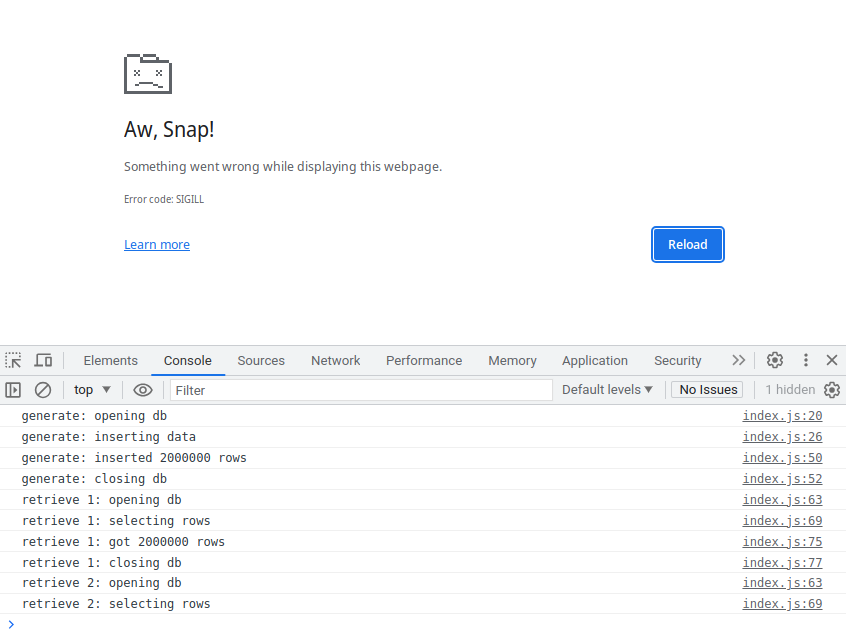

# extension-crash-sqlite

This repository demonstrates crashing a Chrome extension while retrieving data from SQLite WASM backed by OPFS.
It uses the 20230811 prerelease snapshot of SQLite WASM 3.43.

To run this code:
* Load the src/ directory as an unpacked extension into Chrome.
* Click the extension's icon to open the extension in a new tab.
* Open the JavaScript Console to watch for messages.
* Click the "Generate Data" button to create a table with 2 million rows in a new SQLite database.
* Click the "Retrieve Data" button and wait until it finishes.
* Repeat the previous step until the extension crashes. On my machine, it usually crashes on the 2nd retrieve.

This was tested on Chrome 115.0.5790.170 on Linux.

